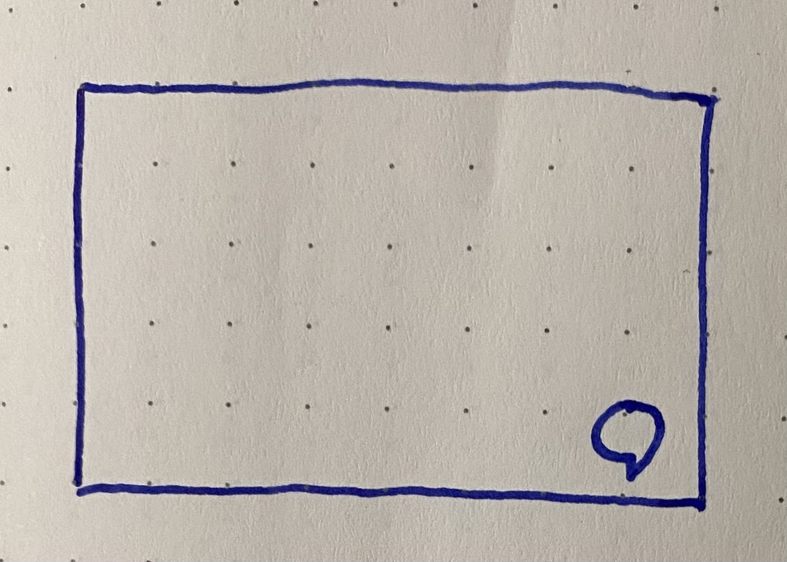
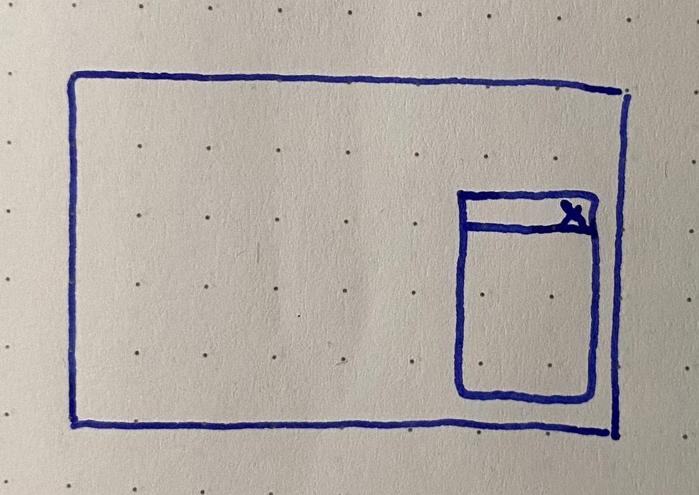

[](https://github.com/SMOC-AI/smoc-widget/actions/workflows/build.yaml)

# Smoc Widget

Smoc Widget is a JavaScript library for embedding the Smoc bot on a web page:



Clicking the button will open the bot:



## Installation

Paste the `<script>` tag below into the pages where you want to enable the Smoc bot. 
We recommend you add this right before the closing `</head>` tag.

```html
<!-- Smoc Bot -->
<script>
    (function(d, w) {
        w.SmocConfig = {
            // Change this to your Smoc bot
            url: 'https://go.smoc.ai/smocdemo/operator_390_channel_rx0k2rv0/operator_390_channel_rx0k2rv0_bot/new?refresh=true&iframe_mode=true',
            color: '#9f51bc',
            shape: 'round', // or 'square'
            position: 'bottom-right' // or 'bottom-left'
            borderRadius: '10px',
            closeButtonColor: '#fff',
        }
        var s = d.createElement('script');
        s.async = true;
        s.src = 'https://unpkg.com/@smocai/smoc-widget@latest';
        if (d.head) d.head.appendChild(s);
    })(document, window);
</script>
```

You'll find your `SmocConversationTemplateId` inside [Smoc Console](https://console.smoc.ai/).

## Configuration

You can customize various visual attributes of the widget:

* Color
* Shape (round or square)
* Position (bottom right, top right etc)

